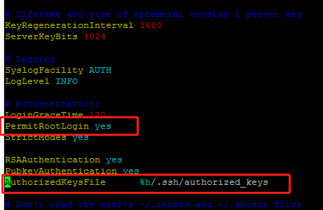
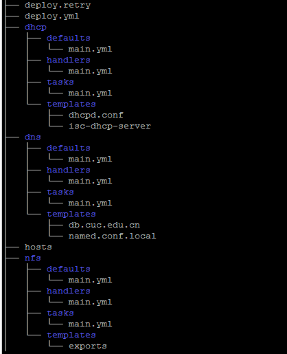
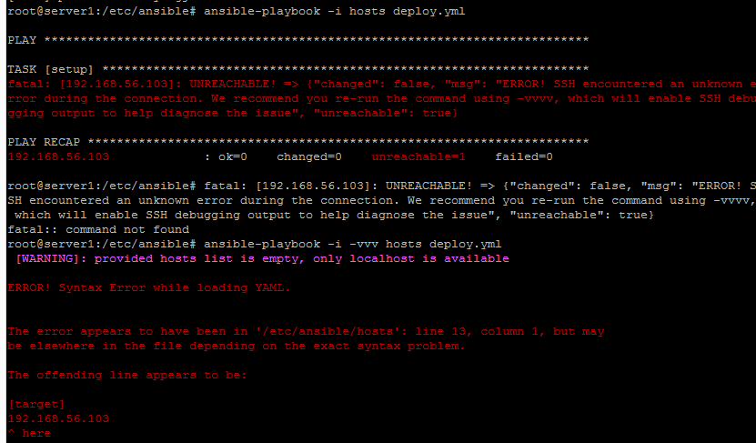

## 使用ansible技术重构FTP、NFS、DHCP、DNS、Samba服务器的自动安装与自动配置     

### 安装ansible    

```
sudo apt update && sudo apt install ansible
```

### root免密登录    

* 修改配置文件/etc/ssh/sshd_config
   

* 生成并配置公钥    

```
ssh-keygen -t rsa
scp .ssh/id_rsa.pub ghan@192.168.56.109:/home/ghan
cat /home/ghan/id_rsa.pub >>/root/.ssh/authorized_keys
```  


### 实验结果    

* 在deploy.yml中用roles定义不同任务，每个roles中
  * tasks执行主脚本，实现配置功能
  * defaults定义配置变量信息
  * handlers负责配置后的重启服务
  * templates是改动好的定制配置文件    

* 实验结果截图    
   

* 出错（-vvvv具体信息 显示是/etc/ansible下的hosts文件出错，但是看了一下就是这条，并没有再加什么其他的）


