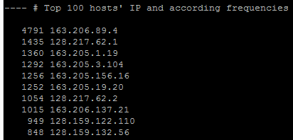
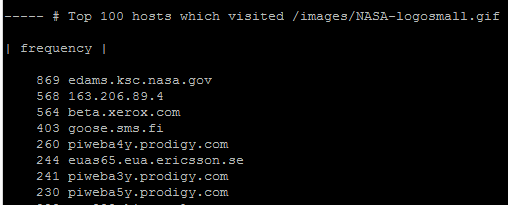

# shell脚本编程基础

## 任务一 还在调试中(未完成)

## 任务二 文本批处理脚本（2014世界杯运动员数据）

### 1. 统计不同年龄区间范围（20岁以下、[20-30]、30岁以上）的球员数量、百分比

### 2. 年龄最大的球员是谁？年龄最小的球员是谁？

### 3. 统计不同场上位置的球员数量、百分比

### 4. 名字最长的球员是谁？名字最短的球员是谁？

## 任务三 文本批处理脚本（Web服务器访问日志）

### 1. 统计访问来源主机TOP 100和分别对应出现的总次数

### 2. 统计访问来源主机TOP 100 IP和分别对应出现的总次数

### 3. 统计最频繁被访问的URL TOP 100

### 4. 统计不同响应状态码的出现次数和对应百分比

### 5. 分别统计不同4XX状态码对应的TOP 10 URL和对应出现的总次数

### 6. 给定URL输出TOP 100访问来源主机

   

## 学习
* 这两个直接参考了的师姐的作业（照着敲），学习了师姐代码的写法（师姐写的很整洁也比较容易弄清楚结构）

* sed, awk, egrep, bc, sort, uniq 组合使用

* sed     
    * (1)sed总是以行对输入进行处理
    * (2)sed处理的不是原文件而是原文件的拷贝

* awk
    * 将每一个输入行定义为一个记录，行中的每个字符串定义为一个域(段)，域和域之间使用分割符分割。

* egrep
    * egrep 命令用于在文件内查找指定的字符串
    
* bc
    * 用bc进行浮点运算

* sort
    * 排序

* uniq
    * 报告或删除文件中重复的行

## 参考

* [优秀的陈安莹师姐的实验四](https://github.com/AeroOwl/linux/tree/master/2017-1/cay/ex4)
* [Shell学习之-sed用法解析](https://blog.csdn.net/zg_hover/article/details/1804481)
* [Shell脚本之awk详解](https://blog.csdn.net/imxiangzi/article/details/49762247)
* [Shell的egrep、grep、fgrep命令的使用](https://www.cnblogs.com/cindy-cindy/p/6890310.html)
* [Shell中用bc进行浮点运算](https://blog.csdn.net/liuchongming/article/details/6408746)
* [linux sort,uniq,cut,wc命令详解](https://www.cnblogs.com/ggjucheng/archive/2013/01/13/2858385.html)
