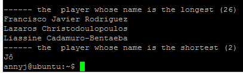
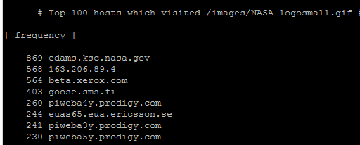

# 第三章：动手实战SYSTEMD

----------

## 一、环境配置

* Ubuntu 16.04 Server 64bit
* 注册asciinema账号，在本地安装配置asciinema

## 二、实验过程

### 1、 [Systemd 入门教程：命令篇](http://www.ruanyifeng.com/blog/2016/03/systemd-tutorial-commands.html)

* 操作演示：
   * [由来+Systemd概述+系统管理](https://asciinema.org/a/6KUYcW8kd7k1Uk36nILHnWDrE)
      * **设置当前时区失败**  
      * **没有录制3.1 systemctl的指令**
   * [Unit](https://asciinema.org/a/sSBnhLyhaGfgl2AmXjWQ1zqaS)
   * [Unit 的配置文件](https://asciinema.org/a/QzKc4LrI256W2RQwdy9ZM22sH)
   * [Target](https://asciinema.org/a/5Y2D9JiTsWjpJwf0bAivndjqP)
   * [日志管理](https://asciinema.org/a/4yefJNXMB6EBGC5AvDjsmTShO)

### 2、 [Systemd 入门教程：实战篇](http://www.ruanyifeng.com/blog/2016/03/systemd-tutorial-part-two.html)

* 操作演示：
   * [Systemd实战](https://asciinema.org/a/WIYy3X6YOMz6SMHcju85bGsN4)

### 自查清单

* 如何添加一个用户并使其具备sudo执行程序的权限？
  
   * sudo adduser poiuy[username]
   * sudo vim /etc/sudoers
   * 在# User privilege specification 下加上  poiuy  ALL=(ALL:ALL) ALL
   * 

* 如何将一个用户添加到一个用户组？

   * 

* 如何查看当前系统的分区表和文件系统详细信息？

   * 

* 如何实现开机自动挂载Virtualbox的共享目录分区？

   * sudo vim /etc/fstab
   * 

* 基于LVM（逻辑分卷管理）的分区如何实现动态扩容和缩减容量？

   * 
   * 
   * 
   * 
   * 

* 如何通过systemd设置实现在网络连通时运行一个指定脚本，在网络断开时运行另一个脚本？

   * 修改networking.service配置文件中的ExecStart和ExecStop 

* 如何通过systemd设置实现一个脚本在任何情况下被杀死之后会立即重新启动？实现杀不死？

   * 修改脚本配置文件中[service]模块:  Restart= always

