# 实验五 Web服务器配置   

## 环境搭建（基本要求）

### 使用虚拟机环境       
  * ubuntu-server1     
    * ubuntu 16.04    
    * VeryNginx(80端口)
    * Nginx(8080端口)
    * host-only：192.168.56.103         

  * ubuntu-server2
    * ubuntu 16.04
    * wordpress
    * host-only:192.168.56.104      

  * ubuntu-server3         
    * ubuntu 16.04
    * dvwa
    * host-only:192.168.56.105     

### 安装VeryNginx       

* [参考中文文档](https://github.com/alexazhou/VeryNginx/blob/master/readme_zh.md)     

* 安装成功        

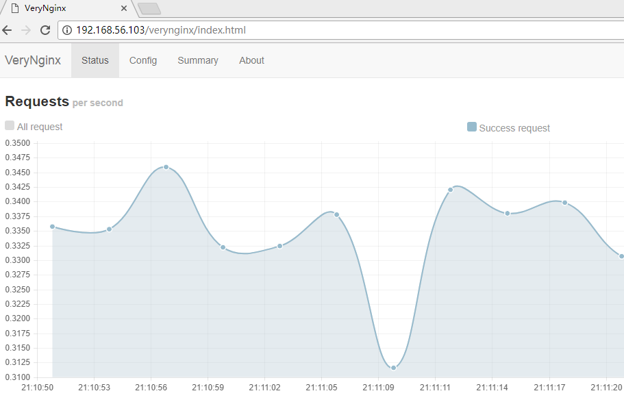   

* 同时配置Nginx和VeryNginx
  * Nginx端口为8080
  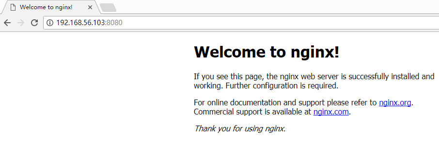

### 安装WordPress   

* [安装LAMP](https://www.digitalocean.com/community/tutorials/how-to-install-linux-apache-mysql-php-lamp-stack-on-ubuntu-16-04)    

* [安装WordPress](https://www.digitalocean.com/community/tutorials/how-to-install-wordpress-with-lamp-on-ubuntu-16-04)

* 安装成功

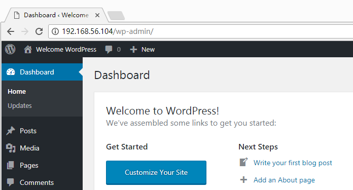   

### 安装DVWA   

* 安装未成功（还在解决）

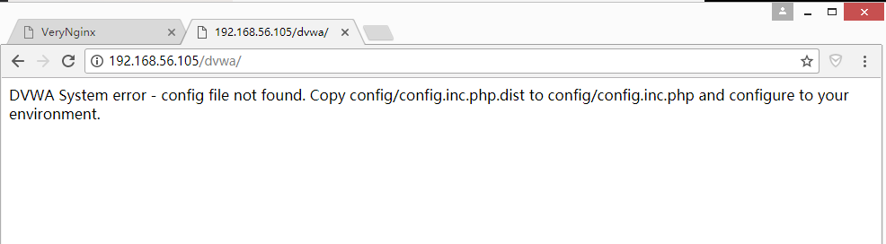

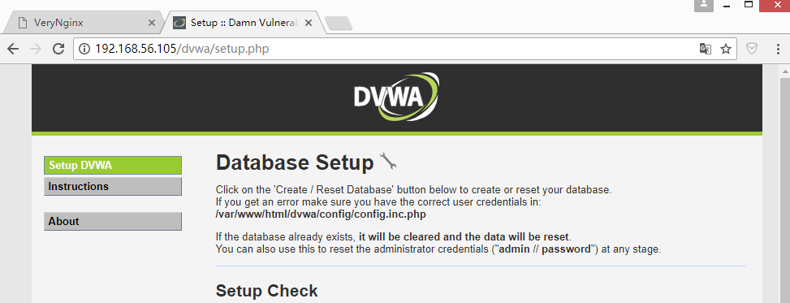

* 点击创建数据库，出现问题

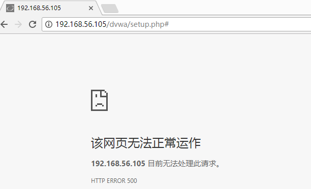

### 设置反向代理    

！！！！config设置了add好几次，也没能成功显示，导致以下要求没能实现
（。。。。。。）

* verynginx配置应为如下(这是展示的是成功设置的同学应该有的截图)  

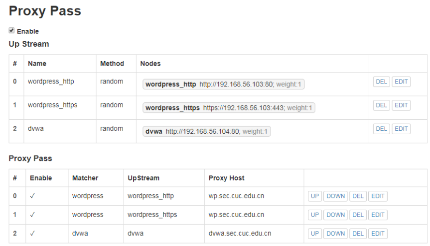     

应该在如下的操作界面设置反向代理，实现要求

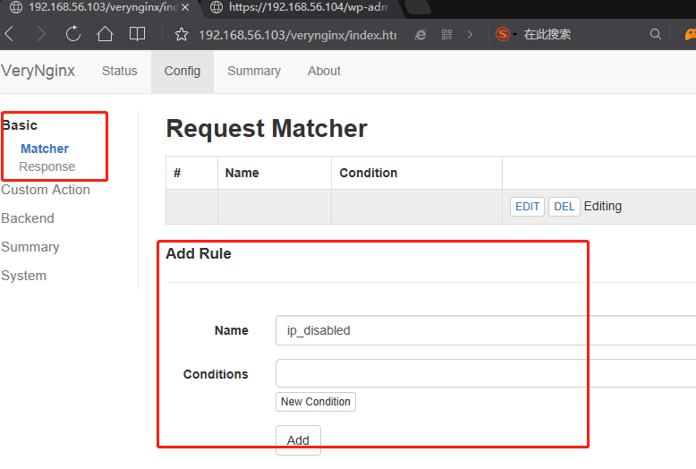

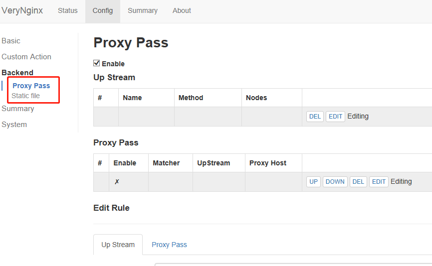       

## 安全加固要求思路 （和设置反向代理时一样，修改配置加了很多次，没能成功，很迷，emmm因为自身搞得在期限内交不了成功的实验，只能暂时先交这份简陋版）

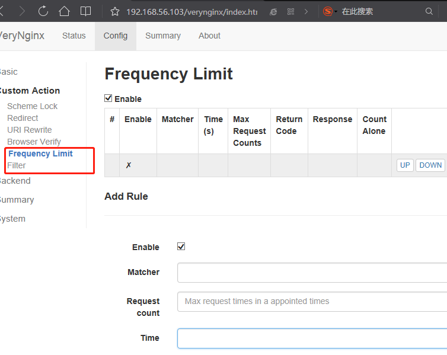

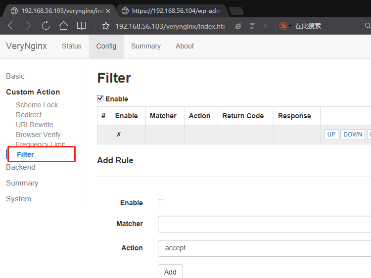

* 使用IP地址方式均无法访问上述任意站点，并向访客展示自定义的友好错误提示信息页面-1            
  verynginx配置相应 matcher response filter 项   

* Damn Vulnerable Web Application (DVWA)只允许白名单上的访客来源IP，其他来源的IP访问均向访客展示自定义的友好错误提示信息页面-2        
verynginx配置 matcher response filter 项 

* 在不升级Wordpress版本的情况下，通过定制VeryNginx的访问控制策略规则，热修复WordPress < 4.7.1 - Username Enumeration     
  * 修复思路：禁止对/wp-json/wp/v2/users/的访问    

  * verynginx配置 matcher response filter 项

* 通过配置VeryNginx的Filter规则实现对Damn Vulnerable Web Application (DVWA)的SQL注入实验在低安全等级条件下进行防护           

## verynginx配置要求

* VeryNginx的Web管理页面仅允许白名单上的访客来源IP，其他来源的IP访问均向访客展示自定义的友好错误提示信息页面-3        

* 通过定制VeryNginx的访问控制策略规则实现：    
  * 限制DVWA站点的单IP访问速率为每秒请求数 < 50      

  * 限制Wordpress站点的单IP访问速率为每秒请求数 < 20       

  * 超过访问频率限制的请求直接返回自定义错误提示信息页面   

  * 禁止curl访问

 * verynginx配置相应 response，Frequency Limit，filter，master 项

